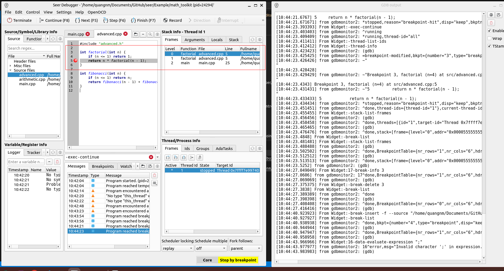

# Feature
… == in progress
⚠ == Warning
✓ == done, fixed
✗ == cancelled
1. Start OpenOCD process                                                                        ✓
2. Capture OpenOCD log                                                                          ✓ 
3. Start GDB-multiarch process                                                                  ✓ 
4. Connect GDB-multiarch to OpenOCD port                                                        ✓
5. display source code debug on Stm32                                                           ✓
6. on Breakpoints/Watchpoints Tab ..., Can i remove some col, like number, adress, ...?
7. Can i add dock feature to every tab?
8. Add OpenOCD -> add insmode kernel module.
9. Add help, readme     (minimum priority)
10. Add feature: disable actionControlNext, actionControlStep,actionControlFinish               ✓
    while target is running and enable them when target is halted (this can fix some bug)
11. check: test stepi and nexti on openocd
12. Add multiple backtrace pointer color (like vscode) (already deployed)                       ✗
13. Debug kernel (HIGH PRIORITY)                                                                ... seem unstable
14. Debug kernel module (HIGH PRIORITY)
15. Add status indicator, display status: running, stopped, stop at breakpoint, disconnected,
    running core. (enhance SeerRunStatusIndicatorBox)                                           ... (disconnected will be fixed along with openocd)
16. add docker config path                                                                      ✓
17. Can I track code when press ctrl + left click?
18. Can I go back to previous tab like vscode?
19. On Source info: search regex...: can I input kernel/module/main.c and seer look that for me?
20. Check file availability before run debug on init, load kernel, kernel module ...
21. When bp is disabled, enabled, will its status be displayed accordingly?
            (yes, it works on desktop app but not with openocd)                                 ✓
22. Why don't we add macro to enable/disable debug on cmakelist?                                ✓ enable on cmake
23. Add reset target for openocd
# Bug:
- Insert, remove breakpoint during running for openocd (HIGH PRIORITY)                                              ✓
- Breakpoints don't show up in "Breakpoints" Tab for openocd                                                        ✓
- Multiple breakpoints at one point.
    To reporoduce: add breakpoint at unaddable point (like at "}" or empty line) (both on desktop and openocd)
- Bug on highlighting current execution line, it is not erase color while continuing (starting from main)           ✓
- Recursion: In case of recursion, SeerEditorWidgetSourceArea::addCurrentLine keeps pointing to 1 line              ✓
    thus color is wrong.
    Eg: frame level 0 points to line 5 but you can see that line 5 is grey, this is because factorial function is recursive, 
    so "yellow line" is overwritten by "grey line"
    
- when re-open openocd launch mode then close seergdb, causing hang up on exit (not clear if it is major bug)       ✗
- on debugging math_toolkit, cannot close nanosleep.c source code tab                                               ✓
- Bug: on hitting breakpoints, continue, next, step button aren't enabled                                           ✓
- When actiongdbterminate button is clicked when program/target is running, run status bar (bottom right) and
    cursor doesn't return to normal                                                                                 ✓
- Check when finish button is clicked (on desktop)
- click on openocd menubar -> esc -> openocd menubar disappear

# To fix attach to target issue
2 solutions:
- ```sudo seergdb```
- Edit /etc/sysctl.d/10-ptrace.conf (or /etc/sysctl.d/99-sysctl.conf)<br>
```kernel.yama.ptrace_scope = 0```
# To build a new nucleo_blink LED:
board: STM32_Smart V2.0J
cd stm32f1_blink
run build.sh
let it do the rest
Final hex file is stm32f1_blink/build/main.elf, it will be automatically flashed to board
# Debug using gdb-multiarch
openocd -f /home/quangnm/Documents/GitHub/seer/openocd/tcl/interface/jlink.cfg -f /home/quangnm/Documents/GitHub/seer/openocd/tcl/target/stm32f1x.cfg
# Essential GDB MI command
-break-insert -t -h --source filename --function function --line lineoffset -d                  : add breakpoint
-break-delete (number)                                                                          : delete breakpoint
-break-disable (number)                                                                         : disable breakpoint
-break-enable (number)                                                                          : enable breakpoint
-break-info (number)
-break-list                                                                                     : check p623
-environment-cd                                                                                 : set gdb working directory
-environment-directory (dir)                                                                    : equal to gdb `directory` command
-exec-continue                                                                                  : continue
-exec-finish                                                                                    : ??
-exec-interrupt                                                                                 : Ctrl C
-exec-jump                                                                                      : jump to func, rarely use in openocd
-exec-return                                                                                    : make current func return immediately
-exec-next                                                                                      : next
-exec-step                                                                                      : step
-stack-list-frames                                                                              : backtrace
-file-exec-and-symbols (file)                                                                   : equal to gdb `file` command
-target-select extended-remote :3333                                                            : equal to gdb `target extended-remote :3333` command

# Prefix expplain
| Prefix | Type                  | Description                                                                 | Example |
|--------|-----------------------|-----------------------------------------------------------------------------|---------|
| `^`    | **Result Record**     | Response to a command you issued. Ends with `done`, `running`, `connected`, or `error`. | `^done` |
| `*`    | **Exec Async Output** | Execution status changes (e.g., stopped, running).                          | `*stopped,reason="breakpoint-hit",frame={...}` |
| `+`    | **Status Async Output** | Progress information for long operations (rarely used).                    | `+download,{section=".text",section-size="0x1000",...}` |
| `=`    | **Notify Async Output** | Asynchronous notifications (e.g., thread creation, stop events).           | `=thread-created,id="2",group-id="i1"` |
| `~`    | **Console Output**    | Human-readable text from GDB (like CLI output).                             | `~"Breakpoint 1 at 0x400123: file main.c, line 42.\n"` |
| `@`    | **Target Output**     | Output from the program being debugged (stdout/stderr).                     | `@"Hello, world!\n"` |
| `&`    | **Log Output**        | GDB internal logs, warnings, or debug messages.                             | `&"warning: Invalid register value\n"` |

# Install GamaRay
1. Install QT6 suitable for GammaRay (typ 6.6): purge QT5 and QT6
Adjust -prefix to where you want Qt installed (e.g. /opt/Qt/6.6.0).
```
sudo apt update
sudo apt install build-essential git cmake pkg-config \
     libglib2.0-dev libx11-dev libxcb1-dev libxkbcommon-dev \
     libssl-dev libpng-dev libjpeg-dev libfreetype6-dev \
     libfontconfig1-dev libxcb-xinerama0-dev libxcb-icccm4-dev \
     libxcb-keysyms1-dev libxcb-render-util0-dev
cd ~/Downloads
wget https://download.qt.io/archive/qt/6.6/6.6.0/single/qt-everywhere-src-6.6.0.tar.xz
tar xf qt-everywhere-src-6.6.0.tar.xz
cd qt-everywhere-src-6.6.0
mkdir build && cd build
../configure -prefix $HOME/Qt/6.6.0 \
             -opensource -confirm-license \
             -nomake tests -nomake examples
make -j$(nproc)
sudo make install
```
Add following to ~/.bashrc
```
export PATH=$HOME/Qt/6.6.0/bin:$PATH
export LD_LIBRARY_PATH=#HOME/Qt/6.6.0/lib:$LD_LIBRARY_PATH
```
run `qmake -v` to verify

#
$ sudo lsof -i :3333
COMMAND       PID    USER   FD   TYPE  DEVICE SIZE/OFF NODE NAME
openocd   2953829 g703808    8u  IPv4 9597687      0t0  TCP *:3333 (LISTEN)
openocd   2953829 g703808   11u  IPv4 9666948      0t0  TCP localhost:3333->localhost:41664 (ESTABLISHED)
gdb-multi 2953831 g703808    9u  IPv4 9701167      0t0  TCP localhost:41664->localhost:3333 (ESTABLISHED)
